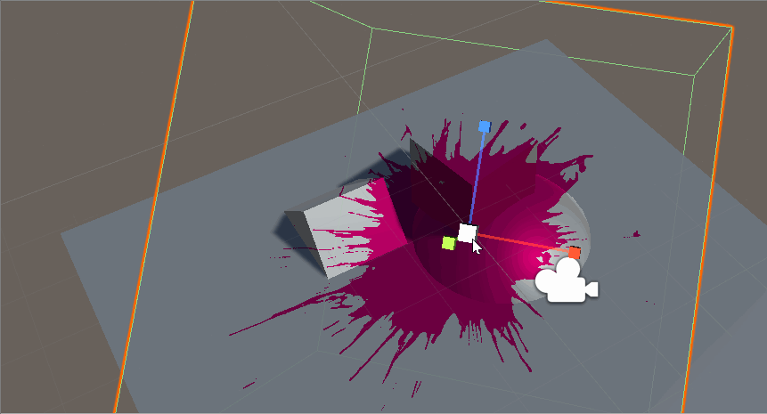
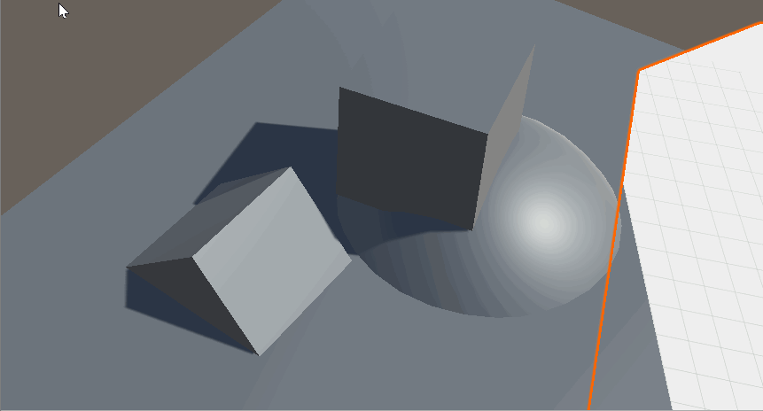
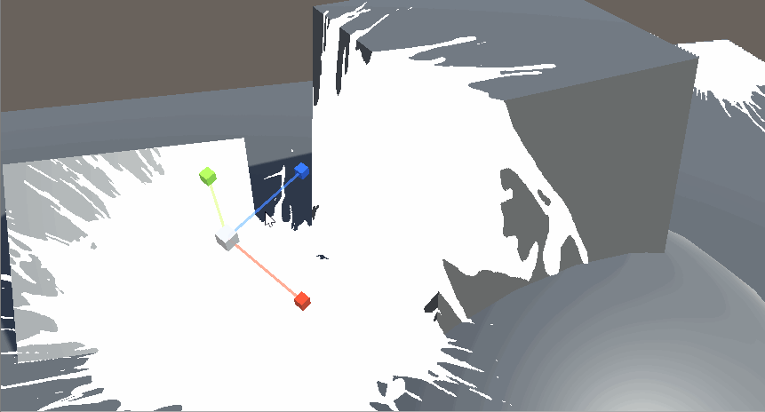
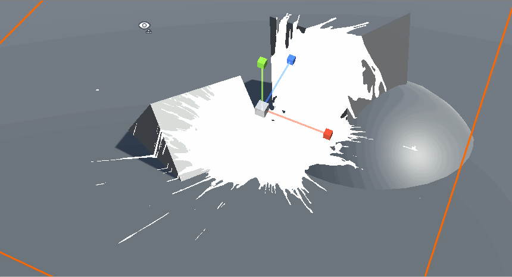

# //EP1// Shader实现的贴花效果

## Overall
实用性： 还行

美观程度： 能看

## Thought Process

想起了伪·焦散Shader。
利用世界坐标，对焦散贴图进行采样，实现简易的焦散效果。

仔细思考之后，发现说不定可以用在贴花Shader上。

## Idea
1. 打开DepthTexture。
2. 根据相机当前位置以及DepthTexture采样，取出当前像素点的世界坐标。
3. 将世界坐标转换为局部空间坐标，采样贴花。
4. Clip掉多余的像素。
5. 亿点微调

## 1. DepthTexture

把这个脚本加在相机上，启用DepthTexture。
```
void OnEnable()
{
	this.targetCamera = GetComponent<Camera>();
	targetCamera.depthTextureMode = DepthTextureMode.Depth;
}
```

后来发现只有带有ShadowCaster的Pass的材质会写进DepthTexture。

## 2. 世界坐标

比较直接。通过相机坐标以及朝向，求出C所在的像素位置。
```
fixed4 frag(...)
{
	//采样深度图
	fixed4 screenDepth = tex2D(_CameraDepthTexture, i.screenPosition.xy / i.screenPosition.w);
	float linearEyeDepth = LinearEyeDepth(screenDepth);
	//求出世界坐标
	float3 pixelWorldPos = cameraDirection / i.screenPosition.w * linearEyeDepth - _WorldSpaceCameraPos;
}
```


## 3. 转换空间
当下的坐标还是在世界空间，所以用世界变换矩阵的逆矩阵，乘上当前的坐标，取出来的就是局部空间的坐标了。
```
fixed4 frag(...)
{
	//inverse project to object space:
	float3 objectSpacePos = mul(unity_WorldToObject, pixelWorldPos);
	objectSpacePos.xz -= mul(unity_WorldToObject, float4(0, 0, 0, 1)).xz;
}
```

这个时候就可以直接对贴图进行采样了。可以看到，投影出的结果会受到物体的转动和缩放影响。

```
fixed4 frag(...)
{
	float4 sampledCol = tex2D(_MainTex, objectSpacePos.xz + 0.5) * _Color;
	//...
	return sampledCol;
}
```



## 4. Clip
首先换上了一个透明的贴花，然后clip掉了透明度<0.5的部分。
```
fixed4 frag(...)
{
	//...
	clip(sampledCol.a - 0.5);
	return sampledCol;
}
```
但是这并没有解决所有的问题。在特定的角度下，可以透过贴花体积看到不应该存在的多余部分。


想要clip掉这些部分也相当简单，毕竟我们已经在局部空间坐标下了。只要局部空间xz坐标不在[0-1]这个区间内，我们完全可以放心的clip掉他们

```
fixed4 frag(...)
{
	float clip_amount = min(0.5 - objectSpacePos.x * objectSpacePos.x, 0.5 - objectSpacePos.z * objectSpacePos.z);
	clip(clip_amount - (1 - sampledCol.a));
}
```



## 5. 微调
```
Blend DstColor Zero
ZTest Off
Cull Off
ZWrite Off
```
打开了Alpha Blend (叠加的效果感觉最好)，关掉ZWrite，ZTest和Clip，齐活 


## 6. 为什么实用性不高

如果体积太窄或者太矮了，特定情况下会有贴花渲染不全的情况。这点在用的贴花不是透明材质的时候最为严重。